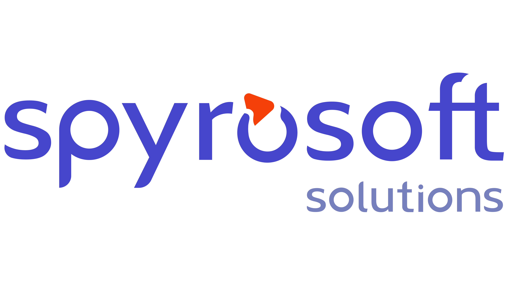

About
=====

scargo was started by Spyrosoft Solution S.A. as an R&D project. The idea should strongly refer to RUST language.
scargo source code and this documentation are released as Free Software under MIT license.

