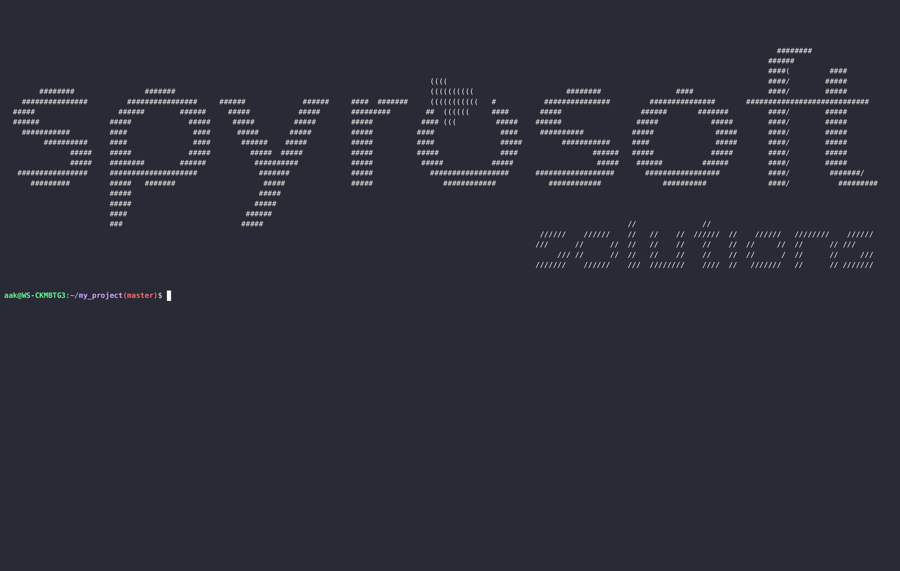

.. _scargo_build:

Build C/C++ project: build
---------------------------

Usage
^^^^^
::

    scargo build [OPTIONS]

Description
^^^^^^^^^^^
Compile sources.

Options
^^^^^^^
::

--profile Arg

This option specifies the profile. ARG can be Debug, Release, RelWIthDebugInfo, or MinSizeRel.
Users can define their profiles. Those should be added under the ``[profile.(custom tag)]`` section in scargo.toml file.

If this option is not used, then the default profile is Debug.

Example 1
^^^^^^^^^
Command:
::

    scargo build

**Effects:**

It will use conan to download all dependencies and build the project in build/Debug dir

NOTES: This command has the same effects as scargo build --profile Debug

Example 2
^^^^^^^^^
Command:
::

    scargo build --profile Release

**Effects:**

It will use conan to download all dependencies and build the project in build/Release dir

Notes 1
^^^^^^^
scargo is case-sensitive about profile names.
The same behavior must be when using scargo build.
For example, all of the following three lines have different meanings:
::

    scargo build --profile Release
    scargo build --profile REleASe
    scargo build --profile RELEase

The first command will create the build/Release directory. Since scargo is case-sensitive for profile names, subsequent commands will create new directories: build/REleASe, build/RELEase.

Notes 2
^^^^^^^
scargo by default defines four profiles:

- Debug
- Release
- RelWithDebugInfo
- MinSizeRel

The user can define their own profiles.
