.. _scargo_clean:

Clean C/C++ project artifacts
-----------------------------

Usage
^^^^^
::

    scargo clean [OPTIONS]

Description
^^^^^^^^^^^

Clean build directory. Keeps cmake fetched content in build/.cmake_fetch_cache.

Options
^^^^^^^

::

-B, --base-dir DIRECTORY

Specify the base project path. Allows running scargo commands from any directory.

Example
^^^^^^^

Command:
::

    scargo clean

**Effects:**

Cleans directory build

Cleans directory test/build