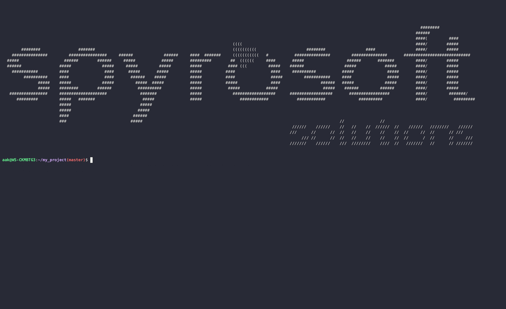

.. _scargo_debug:

Debug C/C++ project binary (x86 and stm32 supported)
----------------------------------------------------

Usage
^^^^^

::

    scargo debug [OPTIONS]

Description
^^^^^^^^^^^

Use gdb cli to debug binary file. If path to bin is not provided in arguments
scargo will look in lockfile for bin_name under project section and look for
binary on path ``build/debug/bin/<bin_name>``.

Scargo currently supports debug for x86 and stm32 targets.

Options
^^^^^^^

::

-b, --bin FILE

Path to a binary file
