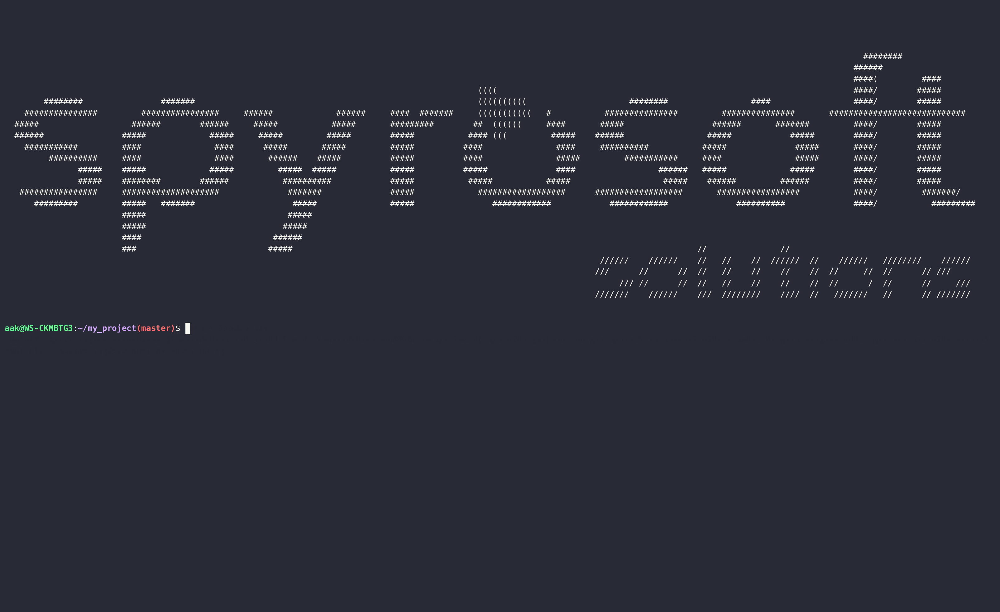

.. _scargo_fix:

Fix C/C++ project with static tool analyzers issues
---------------------------------------------------

Usage
^^^^^

::

    scargo fix [OPTIONS]

Description
^^^^^^^^^^^

Fix chosen problem discovered using checkers in src dir and all subdirectories.

Options
^^^^^^^

::

--all

Perform all available fixes. This option is the default if no other options are specified.

::

--pragma

Fix if there is no #pragma once at the top of each header file.

::

--copyright

Fix if there is no copyright info at the top of each file.

::

--clang-format

Fix formatting reported by clang-format.
