.. _scargo_fix:

Fix C/C++ project with static tool analyzers issues
---------------------------------------------------

Usage
^^^^^

::

    scargo fix [OPTIONS]

Description
^^^^^^^^^^^

Fix chosen problem discovered using checkers in src dir and all subdirectories.

Options
^^^^^^^

::

--clang-format

Fix formatting reported by clang-format.

::

--copyright

Fix if there is no copyright info at the top of each file. You can define your own copyright info in the config file in [fix.copyright] section.

::

--pragma

Fix if there is no #pragma once at the top of each header file.

::

-B, --base-dir DIRECTORY

Specify the base project path. Allows running scargo commands from any directory.
