.. _scargo_new:

Create new C/C++ project : new
------------------------------

Usage
^^^^^
::

    scargo new PROJECT_NAME [OPTIONS]

Description
^^^^^^^^^^^

Create new project template.

Options
^^^^^^^^
::

    --bin TEXT

Creates template of the binary target. The target name is TEXT. Creates template file "[TEXT].cpp" in directory "src".

::

    --lib TEXT

Creates template of library target. The target name is TEXT.  Creates template file "[TEXT].cpp" in directory "src".

::

    --docker

Create docker environment.

::

    --no-git

Do not initialize git repository.

::

    --target

Chose the target on which you would like to build and manage the project ['x86', 'esp32', 'stm32', 'atsam'].
ESP32 support: Presently following models are supported 'esp32', 'esp32c2', 'esp32c3', 'esp32s2', 'esp32s3'.
STM32 support: Presently there is support for stm32l4 only. Specify chip using --chip or use default (STM32L496AG).
Atmel SAM series support: Presently scargo supports Atmel SAM series. Specify chip using --chip or use default (ATSAML10E16A).

::

    --chip CHIP_LABEL

Specify chip for a target. Defaults chip will be used if not used.
Defaults:

* stm32: STM32L496AG
* atsam: ATSAML10E16A

::

    -B, --base-dir Arg

Specify the base project path. Allows running scargo commands from any directory.

Notes
^^^^^
Each target must have an unique name. Error if two targets have the same name.

Example 1
^^^^^^^^^
Command:
::

    scargo new hello_world --bin foo --lib bar

**Effects:**

Creates project template. The project name is hello_world. Also creates a template for a binary target named foo and creates the template for the library target name bar.
Creates new directory hello_world. This is the root directory of the project.
Enters directory hello_world.
Creates template of README.md.
Creates template of scargo.toml.
For a full list of options in scargo.toml please look at the description of the command scargo update.
The project name in section [project] must be the same as the project name provided to command scargo new. In this example project name is hello_world.
Creates directory src.
Creates file src/foo.cpp

::

    int main()
    {
    }

Creates file src/bar.cpp

::

    void bar()
    {
    }

Creates file src/CMakeLists.txt

::

    add_executable(foo foo.cpp)
    add_library(bar STATIC bar.cpp)

Initializes git repository.
