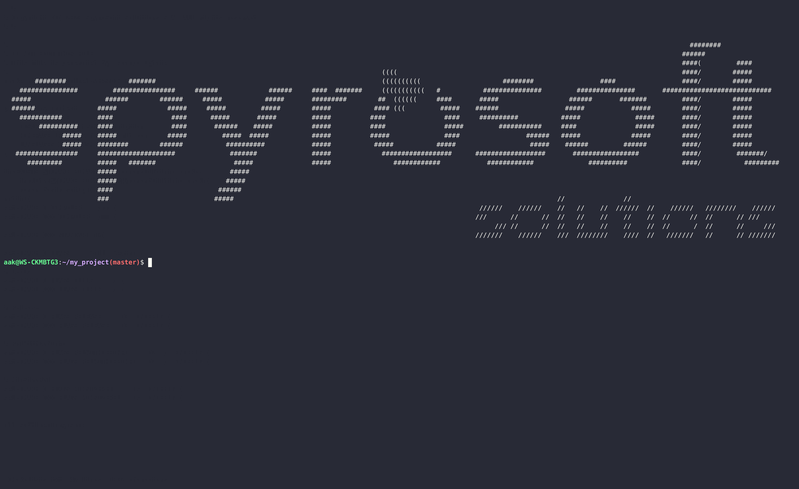

.. _scargo_toml:

scargo.toml file basis
======================

This section describes possible options which can be set in the scargo.toml file.

[project]
---------
**name** = (string) <project name e.g."esp322">

**version** = (string) <project version must be major.minor.patch e.g. "0.1.0")

**description** = (string) <Project short description e.g. "Proj desc">

**homepage-url** = (string) <project www as url e.g. "https://example.com">

**target** = (string) <target to build the project e.g. "esp32" or "x86">

**build-env** = (string) <"docker" or "native">

**docker-file** = (string) (path to custom docker file. Shall not start with FROM keyword)

**docker-image-tag** = (string) (e.g. "esp322-dev:1.0")

**cc**  = (string) (c compiler e.g. "arm-none-eabi-gcc")

**cxx** = (string) (cpp compiler e.g. "arm-none-eabi-g++")

**cxxstandard** = (string) (c standard  e.g. "17")

**cflags**   = (string) (c compiler flags e.g. "-Wall -Wextra --specs=nosys.specs")

**cxxflags** = (string) (cpp compiler flags e.g. "-Wall -Wextra --specs=nosys.specs")

**in-repo-conan-cache** = (bool) (If set to true conan cache is placed in the repo root - so it persists)

[project.cmake-variables]
-------------------------

(definitions of additional cmake variables independent of profile)

[profile.Debug]
------------------
**cflags**   = (string) (c compiler flags e.g. "-g")

**cxxflags** = (string) (cpp compiler flags e.g."-g")

[profile.Release]
--------------------
**cflags**   = (string) (c compiler flags e.g. "-O3 -DNDEBUG")

**cxxflags** = (string) (cpp compiler flags e.g. "-O3 -DNDEBUG")

[profile.RelWithDebInfo]
---------------------------
**cflags**   = (string) (c compiler flags e.g. "-O2 -g -DNDEBUG")

**cxxflags** = (string) (cpp compiler flags e.g. "-O2 -g -DNDEBUG")

[profile.MinSizeRel]
-----------------------
**cflags**   = (string) (c compiler flags e.g. "-Os -DNDEBUG")

**cxxflags** = (string) (cpp compiler flags e.g."-Os -DNDEBUG")

[check]
-------
**exclude** = (string list)(path to excluded dirs e.g. [])

[check.pragma]
--------------
**exclude** = (string list)(path to excluded dirs e.g. [])

[check.copyright]
-----------------
**exclude** = (string list)(path to excluded dirs e.g. [])

**description** = (string)(copyright information to be included in source files)

[check.todo]
------------
**exclude** = (string list)(path to excluded dirs e.g. [])

**keywords** = (string list)(keywords for todo check, e.g. ["tbd", "todo", "TODO", "fixme"])

[check.clang-format]
--------------------
**exclude** = (string list)(path to excluded dirs e.g. [])

[check.clang-tidy]
------------------
**exclude** = (string list)(path to excluded dirs e.g. [])

[check.cyclomatic]
------------------
**exclude** = (string list)(path to excluded dirs e.g. [])

[doc]
-----
**exclude** = (string list)(path to excluded dirs e.g. [])

[tests]
-------
**cc**  = (string) (c compiler flags e.g. "gcc")

**cxx** = (string) (cpp compiler flags e.g."g++")

**cflags**   = (string) (c compiler flags e.g. "-Wall -Wextra -Og --coverage -fkeep-inline-functions -fkeep-static-consts")

**cxxflags** = (string) (cpp compiler flags e.g. "-Wall -Wextra -Og --coverage -fkeep-inline-functions -fkeep-static-consts")

**gcov-executable** = "" # Empty string -> use default gcov executable

[dependencies]
--------------
Add external dependencies in conan style e.g.:
::

    general = [
        "demo_lib/0.1.0"
    ]
    build = [
    ]
    tool = [
    ]

[conan.repo]
------------
key-value pairs of short names and conan remote urls, e.g.
::

    conancenter = "https://center.conan.io"

Applicable for esp32 only
-------------------------
[esp32]

**partitions** = (string list) (partitions e.g ["nvs,      data, nvs,     0x9000,  0x4000,",

    "otadata,  data, ota,     0xd000,  0x2000,",

    "phy_init, data, phy,     0xf000,  0x1000,",

    "ota_0,    app,  ota_0,   ,        0x180000,",

    "ota_1,    app,  ota_1,   ,        0x180000,",

    "spiffs,   data, spiffs,  ,        0x6000,"])

Applicable for stm32 only
-------------------------
[stm32]
**chip** = (string)

**flash-start** = 0x08000000

[scargo]
--------
**console-log-level** = (string)(define scargo log level to console for project default:"INFO")

**file-log-level** = (string)(define scargo log level to file for project default:"WARNING")