.. _scargo_update:

Update project configuration: update
-------------------------------------

Usage
^^^^^
::

    scargo update [OPTIONS]

Description
^^^^^^^^^^^
Read scargo.toml and generate CMakeLists.txt, conan.py, .devcontainer dir files, and other files.
This command should be run every time you modify the scargo.toml or another .toml configuration file.

Options
^^^^^^^
::

    --c, --config-file FILE

Path to configuration toml file (usually scargo.toml) file.

If the option is not specified, the default value is scargo.toml in the project root directory.

::

-B, --base-dir DIRECTORY

Specify the base project path. Allows running scargo commands from any directory.

List of options in "scargo.toml" and "CMakeLists.txt"
scargo.toml:

::

    [project]
    name = hello_world
    version = 0.1.0
    description = "This is hello world project."
    homepage-url = www.hello-world.com

    cc = arm-none-eabi-gcc
    cxx = arm-none-eabi-g++

    cflags = -Wall -Wextra
    cxxflags = -Wall -Wextra

    [profile.Debug]
    cflags = -g
    cxxflags = -g

    [profile.Release]
    cflags = -O3 -DNDEBUG
    cxxflags = -O3 -DNDEBUG

    [profile.RelWithDebInfo]
    cflags = -O2 -g -DNDEBUG
    cxxflags = -O2 -g -DNDEBUG

    [profile.MinSizeRel]
    cflags = -Os -DNDEBUG
    cxxflags = -Os -DNDEBUG
    CMakeLists.txt:

    cmake_minimum_required(VERSION 3.12)

    project(hello_world
        VERSION 0.1.0
        DESCRIPTION "This is hello world project."
        HOMEPAGE_URL "www.hello-world.com"
        LANGUAGES C CXX
    )

    set(CMAKE_C_COMPILER "arm-none-eabi-gcc")
    set(CMAKE_CXX_COMPILER "arm-none-eabi-g++")

    set(CMAKE_C_FLAGS "-Wall -Wextra")
    set(CMAKE_CXX_FLAGS "-Wall -Wextra")

    set(CMAKE_C_FLAGS_DEBUG "-g")
    set(CMAKE_CXX_FLAGS_DEBUG "-g")

    set(CMAKE_C_FLAGS_RELEASE "-O3 -DNDEBUG")
    set(CMAKE_CXX_FLAGS_RELEASE "-O3 -DNDEBUG")

    set(CMAKE_C_FLAGS_RELWITHDEBUGINFO "-O2 -g -DNDEBUG")
    set(CMAKE_CXX_FLAGS_RELWITHDEBUGINFO "-O2 -g -DNDEBUG")

    set(CMAKE_C_FLAGS_MINSIZEREL "-Os -DNDEBUG")
    set(CMAKE_CXX_FLAGS_MINSIZEREL "-Os -DNDEBUG")

    add_subdirectory(src)

Minimal example
^^^^^^^^^^^^^^^
The only mandatory option in "scargo.toml" is the project name. This is an example of minimal "scargo.toml":

::

    [project]
    name = hello_world

And "CMakeLists.txt" is this:

::

    cmake_minimum_required(VERSION 3.12)

    project(hello_world)

    add_subdirectory(src)

Additional cmake variables
==========================
For each profile and tests it's possible to define additional variables which will end up as cmake variables in main cmake.
For example, if "scargo.toml" has:

::

    ...
    [profile.Debug]
    cflags = "-g"
    cxxflags = "-g"
    first_extra_var = "debug_extra"

    [profile.Release]
    cflags = "-O3 -DNDEBUG"
    cxxflags = "-O3 -DNDEBUG"
    first_extra_var = "release_extra"
    second_extra_var = "second_var"

    [tests]
    cc  = "gcc"
    cxx = "g++"
    cflags   = "-Wall -Wextra -Og --coverage -fkeep-inline-functions -fkeep-static-consts"
    cxxflags = "-Wall -Wextra -Og --coverage -fkeep-inline-functions -fkeep-static-consts"
    gcov-executable = "" # Empty string -> use default gcov executable
    additional-test-var = "something"
    ...

then main "CMakeLists.txt" would contain:

::

    ...
    # Debug
    set(CMAKE_C_FLAGS_DEBUG   "-g")
    set(CMAKE_CXX_FLAGS_DEBUG "-g")
    IF(${CMAKE_BUILD_TYPE} STREQUAL Debug)
        SET(first_extra_var debug_extra)
    ENDIF()

    # Release
    set(CMAKE_C_FLAGS_RELEASE   "-O3 -DNDEBUG")
    set(CMAKE_CXX_FLAGS_RELEASE "-O3 -DNDEBUG")
    IF(${CMAKE_BUILD_TYPE} STREQUAL Release)
        SET(second_extra_var second_var)
        SET(first_extra_var release_extra)
    ENDIF()
    ...

and tests "CMakeLists.txt" would contain:

::

    ...
    SET(additional-test-var something)
    ...

Additional profiles
===================
Profiles in the example above are always defined in CMake, but you can define additional profiles. For example, if "scargo.toml" has this section:

::

    ...
    [profile.xxx]
    cflags = C compiler flags for xxx profile
    cxxflags = C++ compiler flags for xxx profile
    ...

then "CMakeLists.txt" would contain this:

::

    ...
    set(CMAKE_C_FLAGS_XXX "C compiler flags for xxx profile")
    set(CMAKE_CXX_FLAGS_XXX "C++ compiler flags for xxx profile")
    ...

Notes
^^^^^
All CMake variables must be in upper case.